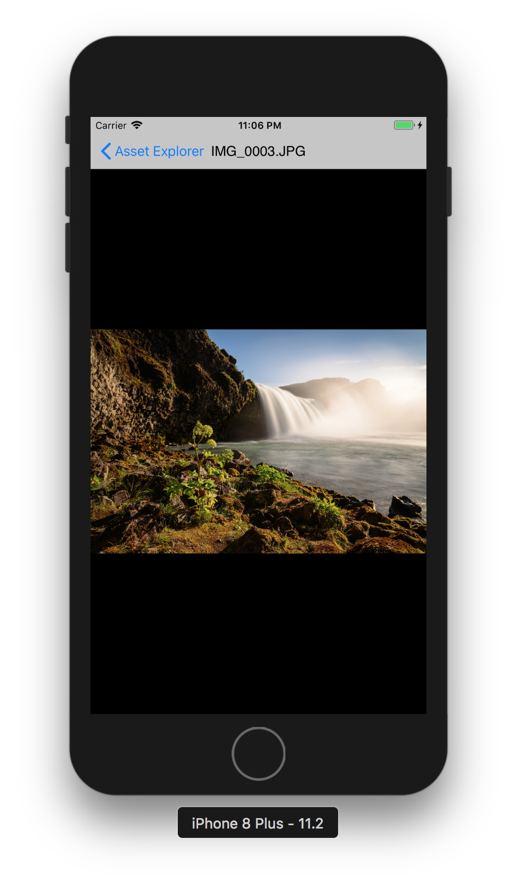

# Asset Explorer

A sample application that fetches uses Photo Framework to fetch Assets and displays it in CollectionView. App provides mechanism to select multiple assets and save it in applicaiton's documents directory.

## Getting Started

These instructions will get you a copy of the project up and running on your local machine for development and debugging purposes.

### Prerequisites

Application is using CocoaPods for dependency management. In order to install CocoaPods run following command on Terminal:

```
$ sudo gem install cocoapods
```
See [Getting Started on CocoaPods](https://guides.cocoapods.org/using/getting-started.html) for more informaiton.


### Installing
- Open Terminal and run following command to install pods:
```
$ pod install
```
- Navigate to project directory and open project using *AssetExplorer.xcworkspace*
- Build and run the application on simulator or actual device running iOS 11.0 or later using Xcode 9.X.

## User Guidelines
- Launch application, and permit application to use Photos library.
- After user's consent, application shall automatically load and display photo library items in grid view fashion.
- On tapping any asset, Asset will be opened in new window.
- On tapping select button, user should be able to select multilpe assets, and perform save operation or cancel otherwise.
- Upon save operation complete, a green checkmark will appear on asset item in bottom right corner.


## Application Design
### Directory Structure
Application has been strucutred into three main modules, Sources, Resources, and Supporting Files.
- Soruces contains all appication source code, e.g. Views, Logic, etc
- Resources contains images, localizations files, assets, etc.
- Supporting Files contains different file like, info.plist, main.m and prefix header files.
### Architecture & Patterns
Application has layered architecture with clear division among modules. Major modules are UI, Database, Network, Constants, and Dependencies injected. Following Design Patterns can be seen in action:
- Singleton
- Observer
- Delegation
Other design choices are:
- Also blocks and *GCD* queues are extensivley used.
- *AX* is used as file Prefix.
- Application uses *Storyboard* for defining and laying out all interface controls.

## Main Files
__AXAssetHandler__:
-   _AXAssetHandler_ is a singleton class providing interface to perform different operations with 'PHAsset' objects, like saving, and introspection for assets. It also maintains the download queue for save operations.

__AXAssetListViewController__:
- _AXAssetListViewController_ is the main view controller that displays assets fetched from photo library using Photos Framework. Collection view is used to display assets in grid view fashion.

__AXCollectionView__:
- _AXCollectionView_ is a *UICollectionView* subclass. It registers defualts custom cells.

__AXAssetCell__:
- _UICollectionViewCell_ subclass that displays asset information like name, downloaded state and thumbnail.

__Constants__:
- _Constants_ classholds all constant values, like color codes. You can change different values here to test the applicaiton behavior.

__Macros__:
- _Macros_ file contains utility macros that are used in entire application at different points, e,g; isEmpty(object), etc.

## Sample Screens



## Built With

* [CocoaPods](https://cocoapods.org/) - Dependency Management

## Versioning

Version 1.0
For more information on versioning, see [Semantic Versioning](http://semver.org/).

## Authors

* **Ahmad Ansari** - (https://github.com/ahmadansari)

## License

This project is licensed under the MIT License - see the [LICENSE.md](LICENSE.md) file for details

