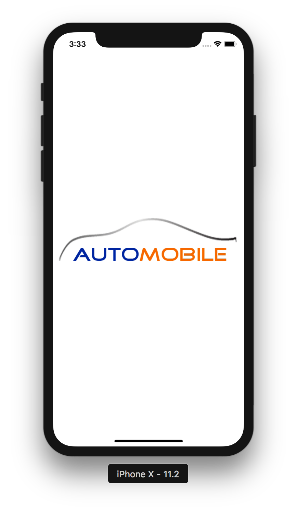
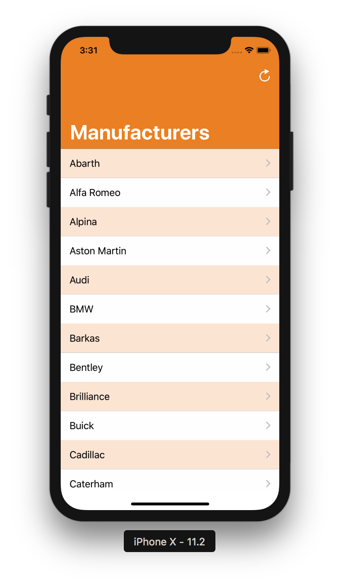
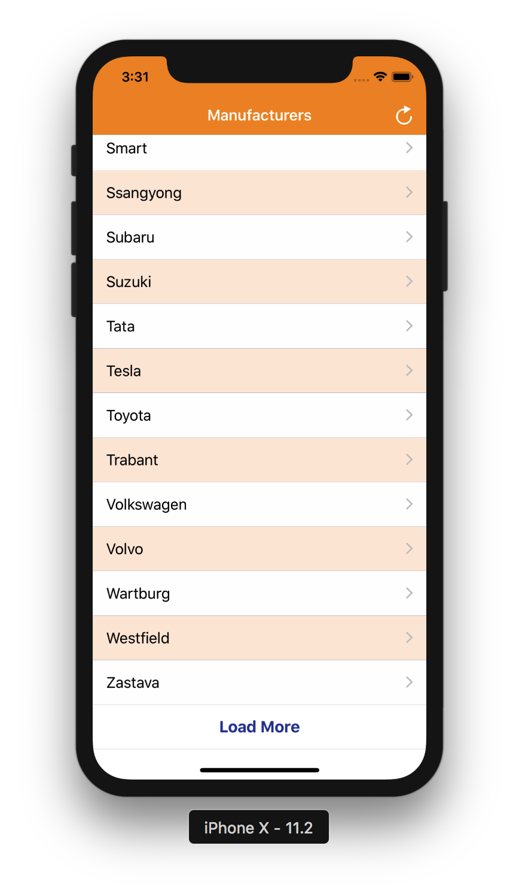
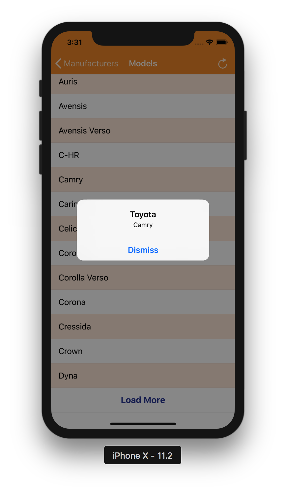

# Automobile Sample App

A sample application that fetches automobiles data from webservices and display list of manufacturers and different models. App uses simple table views to display information in tabular form. Core Data is being used underneath to store information. App provides pagination mechanism to fetch and load more data.

## Getting Started

These instructions will get you a copy of the project up and running on your local machine for development and debugging purposes.

### Prerequisites

Application is using CocoaPods for dependency management. In order to install CocoaPods run following command on Terminal:

```
$ sudo gem install cocoapods
```
See [Getting Started on CocoaPods](https://guides.cocoapods.org/using/getting-started.html) for more informaiton.


### Installing
- Open Terminal and run following command to install pods:
```
$ pod install
```
- Navigate to project directory and open project using *AssetExplorer.xcworkspace*
- Build and run the application on simulator or actual device running iOS 11.0 or later using Xcode 9.X.

## User Guidelines
- On launching the application, app will request first data page, and display it in tableview
- On tapping any manufacturer, model view will open containing list of avilable models.
- On tapping any model an informatory alert will show containing, manufacturer and model.
- Upon tapping the right bar button item, application will refresh current page contents.


## Application Design
### Directory Structure
Application has been strucutred into three main modules, Sources, Resources, and Supporting Files.
- Soruces contains all appication source code, e.g. Views, Models, Services, etc
- Resources contains images, localizations files, assets, etc.
- Supporting Files contains files like info.plist.
### Architecture & Patterns
Application has layered architecture with clear division among modules. Major modules are UI, Database, Services, Constants, and Dependencies injected. Following Design Patterns can be seen in action:
- MVVM (Used with NSManagedObjects)
- Singleton
- Observer
- Delegation
Other design choices are:
- Also closures and *GCD* queues are extensivley used.
- *AT* is used as file Prefix.
- Application uses *Storyboard* for defining and laying out all interface controls.

## Main Files
__ATDataHandler__:
-   _ATDataHandler_ is a singleton class providing interface to perform service fetch request and sending messages to model objects for saving information. This class is hiding all logic for sending requests to service objects and model objects. It decupoles UI from backend logic.

__DatabaseContext__:
- _DatabaseContext_ handles Core Data Stack. It provides utilitiy methods and multiple *NSManagedObjectContext* objects for writing and reading purposes.

__Manufacturer, Model__:
- These are *NSManagedObject* subclasses that contains dynamically generated properites for database model objects. Mainly responsible for providng interface to manipulate data and retrieving information. It decouples all relevant logic to the database entity from other parts like data handler or service handler.

__ObjectViewModels__:
- This class is part of **MVVM** implementaion. It holds two classes *ManufacturerViewModel* and *ModelVM* that are acting as view models for *Manufacturer* and *Model* classes. View models are weakly associatesd with their relevant objects and utility methods for object data formation.


__ATViewController__:
- _ATViewController_ is the template controller for views that use UITableView along with NSFetchedResultscontroller to display Core Data objects. This class defines all common utility methods and leaves implementation for child classes to be provided. Also it hides all FRC boilerplate code so that child controllers do not get messy. Pagination is also handled in this class.

__ATTableViewCells__:
- _ATTableViewCells_ file contains all custom cells, like *ATDefaultCell* and *ATLoadMoreCell*. Both cells provide their own registration mechanism for tableviews.

__ATConstants__:
- _Constants_ holds struct that defines all constant values, keys, service paths, database constants, color codes, etc. You can change different values here to test the applicaiton behavior.

__ATService__:
- _ATService_ contains implementaion for making web request and fetching contents from web services. This class is using Alamofire library for making web request. All implementaion is hidden from child classes. Child classes can uses utility method provided by the class to make simple get request. Service classes ATManufacturerService, and ATManufacturerService both are inherited from ATService and are responsible for providing request parameters on runtime.

## Testing
- Application contains a simple UI Test that shows the application behvaoir and simple flow between manufacturer and model view controllers.


## Sample Screens





## Built With

* [CocoaPods](https://cocoapods.org/) - Dependency Management

## Versioning

Version 1.0
For more information on versioning, see [Semantic Versioning](http://semver.org/).

## Authors

* **Ahmad Ansari** - (https://github.com/ahmadansari)

## License

This project is licensed under the MIT License - see the [LICENSE.md](LICENSE.md) file for details

