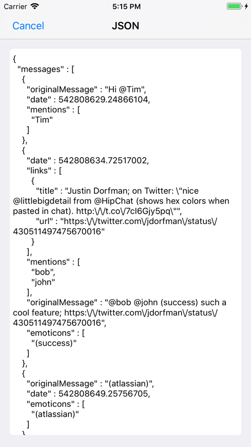

# Chat Serializer App

A prototype application that enables user to start chat with a display name, and converts all message history into a JSON representation.

## Getting Started

These instructions will get you a copy of the project up and running on your local machine for development and debugging purposes.

### Prerequisites

Application is using CocoaPods for dependency management. In order to install CocoaPods run following command on Terminal:

```
$ sudo gem install cocoapods
```
See [Getting Started on CocoaPods](https://guides.cocoapods.org/using/getting-started.html) for more informaiton.


### Installing
- Open Terminal and run following command to install pods:
```
$ pod install
```
- Navigate to project directory and open project using *ChatSerializer.xcworkspace*
- Build and run the application on simulator or actual device running iOS 11.0 or later using Xcode 9.X.

## User Guidelines
- On launching the application, app will request for display name to start new chat
- After saving name, new chat will start on next page.
- Tap on on bottom text field and send message.
- Upon tapping the emoji button, custom emoji keyboard will board, from where you can add custom emoticons.
- On tapping Serialize button, serialized JSON will be displayed for complete chat.
- On tapping a single chat cell, serialized JSON value for specific message will be displayed.

## Sample Screens





See Application Video here:  [appvideo.mp4](Screenshots/appvideo.mp4)

## Built With

* [CocoaPods](https://cocoapods.org/) - Dependency Management

## Versioning

Version 1.0
For more information on versioning, see [Semantic Versioning](http://semver.org/).

## Authors

* **Ahmad Ansari** - (https://github.com/ahmadansari)

## License

This project is licensed under the MIT License - see the [LICENSE.md](LICENSE.md) file for details

